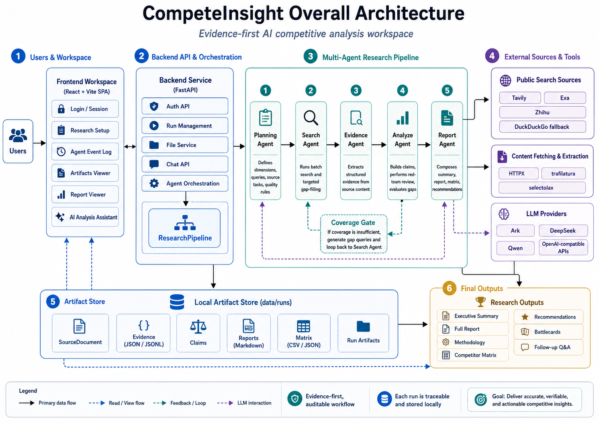
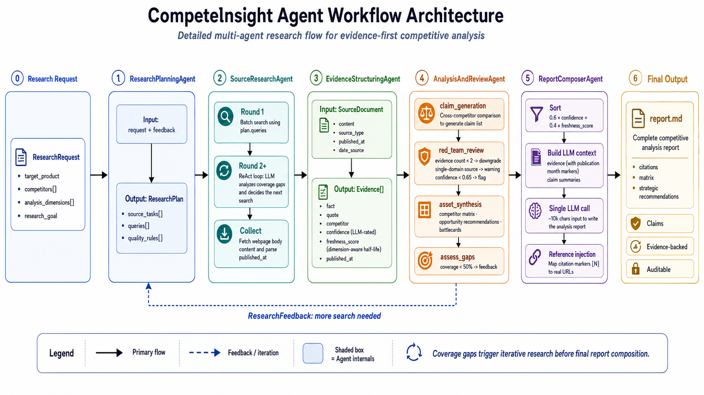

# CompeteInsight

CompeteInsight is an evidence-first AI competitive analysis workspace. Through a multi-agent research pipeline, it turns a rough competitive research question into public sources, structured evidence, red-team-reviewed claims, competitor matrices, Markdown reports, and an AI Analysis Assistant for follow-up questions.

The project is built for the CIS AI-Powered Competitive Analysis Agent Challenge. At this stage, it is optimized more as a public demo and judging workspace than as a full enterprise-grade multi-tenant SaaS product.

## Core Capabilities

* Start a competitive research run from a target product, competitors, research objective, analysis dimensions, and optional seed links.
* The Planning Agent breaks the question down into research dimensions, search queries, source tasks, and quality rules.
* The Search Agent calls public search sources such as Tavily, Exa, Zhihu, and DuckDuckGo fallback to execute batch queries and targeted gap-filling searches.
* The Fetcher retrieves public webpage content and stores auditable `SourceDocument` records.
* The Evidence Agent extracts structured evidence from real page content, preserving URL, quote, competitor, dimension, confidence, freshness, authority, and relevance.
* The Analyze Agent aggregates evidence into claims, adds red-team risk review, and evaluates research gaps.
* The Report Agent generates the summary, full report, methodology, competitor matrix, recommendations, and export files.
* The AI Analysis Assistant supports follow-up questions based on the current research report, evidence, and claims.
* Each run is stored as local artifacts under `data/runs`, making the research process traceable and auditable.

## Technical Architecture



The system uses a frontend-backend separated architecture:

* The frontend is a React + Vite single-page workspace responsible for login, research kickoff, Agent Event Log, Artifacts, Report, and AI Assistant interactions.
* The backend is a FastAPI service responsible for authentication, run management, file serving, chat APIs, and agent orchestration.
* `ResearchPipeline` connects five agent nodes: Planning, Search, Evidence, Analyze, and Report.
* External data comes from Tavily, Exa, Zhihu, and DuckDuckGo fallback. Content extraction is powered by HTTPX, trafilatura, and selectolax.
* The data layer uses a local artifact store, preserving complete research outputs in JSON, JSONL, Markdown, CSV, and related formats.

## Multi-Agent Orchestration



| Agent                      | Responsibility                                                                                                              | Key Outputs                                      |
| -------------------------- | --------------------------------------------------------------------------------------------------------------------------- | ------------------------------------------------ |
| `ResearchPlanningAgent`    | Understands the user's research objective and breaks it down into competitors, dimensions, source tasks, and quality rules. | `ResearchPlan`, `queries`, `quality_rules`       |
| `SourceResearchAgent`      | Executes batch queries, calls multiple search sources, and performs targeted supplementation based on coverage gaps.        | `SourceCandidate`, `SearchMemory`                |
| `EvidenceStructuringAgent` | Extracts facts, quotes, sources, dimensions, competitor attribution, and confidence from real page content.                 | `Evidence`, Evidence index                       |
| `AnalysisAndReviewAgent`   | Aggregates evidence into claims, performs red-team review, and evaluates information gaps.                                  | `Claim`, `RedTeamNote`, `ResearchFeedback`       |
| `ReportComposerAgent`      | Generates readable competitive analysis reports, executive summaries, methodology notes, matrices, and export files.        | `Report`, `Matrix`, Recommendations, Battlecards |

The pipeline includes a Coverage Gate. When evidence coverage is insufficient, source diversity is too low, claim confidence is weak, or clear counter-evidence risks exist, the system generates gap queries and returns to the Search Agent for targeted gap-filling. Only after the coverage quality gate is satisfied does the pipeline proceed to final report generation.

## Tech Stack

* Frontend: React 18, TypeScript, Vite, Framer Motion, Lucide icons.
* Backend: FastAPI, Pydantic, Uvicorn, HTTPX.
* LLM: OpenAI-compatible client with support for Ark, DeepSeek, Qwen, and related configurations.
* Search: Tavily, Exa, Zhihu API, DuckDuckGo fallback.
* Content extraction: HTTPX, selectolax, trafilatura.
* Storage: local JSON, JSONL, Markdown, and CSV artifacts.
* Deployment: Nginx, systemd, uv, pnpm.

## Project Structure

```text
backend/
  cg/
    agents/          # Agent implementations and runtime helpers
    api/             # FastAPI routers
    llm/             # OpenAI-compatible LLM client
    orchestrator/    # ResearchPipeline orchestration layer
    repositories/    # Local run / evidence repositories
    schemas/         # Pydantic data models
    tools/           # Search and content-fetching tools
frontend/
  src/
    App.tsx
    styles/global.css
skills/              # Skill metadata used by the Agent workspace
scripts/             # Deployment and initialization scripts
diagrams/            # Architecture diagrams used in README and submission docs
data/                # Local run artifacts; production deployment does not overwrite server data
```

## Local Development

### Backend

```bash
cd backend
uv sync
uv run uvicorn cg.main:app --reload
```

The default API URL is `http://localhost:8000`.

### Frontend

```bash
cd frontend
pnpm install
pnpm dev
```

The default frontend URL is `http://localhost:5173`.

## Environment Variables

Configure at least one LLM provider in `backend/.env`.

```env
CG_LLM_PROVIDER=ark
CG_LLM_MODEL=your-model-name
ARK_API_KEY=your-ark-key
ARK_BASE_URL=https://ark.cn-beijing.volces.com/api/v3

TAVILY_API_KEY=your-tavily-key
EXA_API_KEY=your-exa-key
ZHIHU_API_KEY=your-zhihu-key

CG_AUTH_USERNAME=your-demo-user
CG_AUTH_PASSWORD=change-me
CG_AUTH_SECRET=replace-with-a-long-random-secret
```

Supported LLM API keys include `ARK_API_KEY`, `DEEPSEEK_API_KEY`, and `QWEN_API_KEY`.

## Login and User Isolation

The current demo uses a lightweight cookie-session login mechanism:

* `POST /api/login`
* `POST /api/logout`
* `GET /api/me`

## Testing

```bash
cd backend
uv run pytest

cd ../frontend
pnpm build
```

## Demo Run Metrics

The hosted demo currently includes a completed sample run for the AI coding assistant landscape:

| Metric              | Value |
| ------------------- | ----: |
| Source candidates   |   282 |
| Sources fetched     |   276 |
| Structured evidence |   479 |
| Claims              |    50 |
| Verified claims     |    33 |
| Challenged claims   |    17 |
| Matrix cells        |    24 |
| Coverage score      | 97.3% |

## Roadmap

* Build an Evidence Graph to visualize `Source -> Evidence -> Claim -> Recommendation`.
* Add report versioning, diff, adoption, and rollback workflows.
* Add research templates for PMs, sales teams, investors, strategy teams, battlecards, and more.
