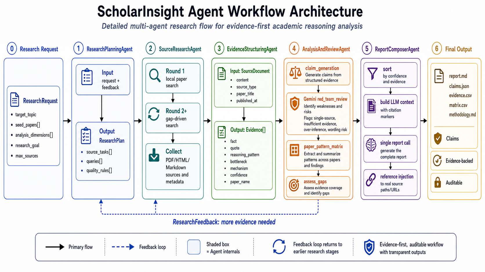

# ScholarInsight

ScholarInsight is an evidence-first academic paper reasoning workspace. It forked from an earlier competitive-analysis codebase, but the active product is now focused on research directions, local paper retrieval, structured innovation evidence, reasoning-pattern claims, red-team review, and cited Markdown reports.

The main use case is turning an AI/ML research topic such as "RAG with Knowledge Graphs" into auditable artifacts: paper candidates, innovation evidence, paper-by-pattern matrices, reviewed claims, research-gap suggestions, and report files for later reuse.

## Core Capabilities

* Start a research run from a target topic, optional seed papers, research goal, reasoning-pattern dimensions, and optional seed URLs or local paths.
* Retrieve papers from the local paper index (`paper_index.json` + `embeddings.npy`) before falling back to any external search tools.
* Extract structured evidence from paper text, including `reasoning_pattern`, `bottleneck`, `mechanism`, quote, confidence, and paper attribution.
* Aggregate evidence into claims and run a strict red-team pass to mark unsupported, single-source, or over-stated conclusions.
* Generate paper-pattern matrices, research recommendations, executive summaries, methodology notes, Markdown reports, JSON exports, and CSV evidence tables.
* Resume interrupted runs from checkpoints and run batch topic processing through `scripts/batch_daemon.py`.

## Reasoning Patterns

ScholarInsight uses 15 reasoning-pattern dimensions:

`gap_driven_reframing`, `cross_domain_synthesis`, `representation_shift`, `modular_pipeline_composition`, `data_evaluation_engineering`, `principled_probabilistic_modeling`, `formal_experimental_tightening`, `approximation_engineering`, `inference_time_control`, `structural_inductive_bias`, `multiscale_hierarchical_modeling`, `mechanistic_decomposition`, `adversary_modeling`, `numerics_systems_codesign`, and `data_centric_optimization`.

## Architecture

The system keeps the original frontend/backend shape:




* Frontend: React + Vite workspace for login, research kickoff, event log, artifact inspection, report viewing, and follow-up chat.
* Backend: FastAPI service for auth, run management, local artifact serving, chat APIs, and agent orchestration.
* Pipeline: `ResearchPlanningAgent -> SourceResearchAgent -> EvidenceStructuringAgent -> AnalysisAndReviewAgent -> ReportComposerAgent`.
* Retrieval: `LocalPaperSearchTool` loads the local paper index and embedding matrix, returning `academic_paper` candidates.
* Storage: every run is stored under `data/runs` as JSON, JSONL, Markdown, and CSV artifacts.

## Project Structure

```text
backend/
  cg/
    agents/          # Agent implementations and runtime helpers
    api/             # FastAPI routers
    llm/             # OpenAI-compatible LLM client
    orchestrator/    # ResearchPipeline orchestration layer
    repositories/    # Local run / evidence repositories
    schemas/         # Pydantic data models
    tools/           # Local paper search and content-fetching tools
  data/
    paper_index.json # Local paper metadata/text index
    embeddings.npy   # Local paper embedding matrix
frontend/
  src/
    App.tsx
    styles/global.css
scripts/
  batch_daemon.py
  build_paper_index.py
  build_embeddings.py
skills/
  *.yaml
```

## Local Development

Backend:

```bash
cd backend
uv sync
uv run uvicorn cg.main:app --reload --host 0.0.0.0 --port 8000
```

Frontend:

```bash
cd frontend
pnpm install
pnpm dev
```

Batch daemon smoke test:

```bash
cd backend
uv run python ../scripts/batch_daemon.py --smoke-test
```

Do not start the full daemon unless you intend to consume MiMo tokens continuously.

## Environment

Copy `backend/.env.example` to `backend/.env` and configure at least one OpenAI-compatible LLM provider. The intended ScholarInsight setup uses MiMo for main analysis and may use Gemini for red-team review.

Required local paper paths:

```env
SCHOLAR_PAPER_INDEX_PATH=/home/zsz/Mimo/ScholarInsight/backend/data/paper_index.json
SCHOLAR_LOCAL_PAPERS_DIR=/home/zsz/papers
```

## Testing

```bash
cd backend
uv run python -m pytest

cd ../frontend
pnpm build
```

## Notes

Some schema properties still accept legacy product-analysis payload fields. They are compatibility shims only; new code and UI should use `target_topic` and `seed_papers`.
