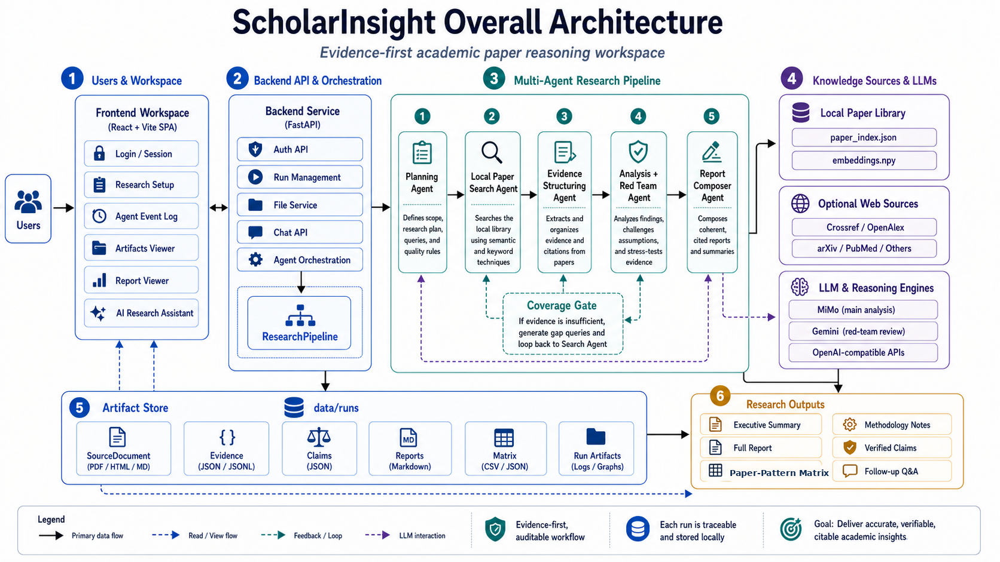

# ScholarInsight 导师沟通 Brief

## 一句话

ScholarInsight 不是让 LLM 凭空“想出一个能发论文的 idea”。它要解决的是：当研究生用 LLM 做文献启发和选题探索时，系统怎样把候选 idea 变成**可审计、可反驳、可继续实验化**的研究方向。

更具体地说，它把“生成 idea”拆成一条证据链：

`topic -> source-role retrieval -> evidence clusters -> claim gate g(c) -> hard negatives / falsification h(c) -> mentor review packet`

这个项目的核心价值不在于替代导师判断 novelty，而在于把 LLM 研究报告中最危险的三件事显式暴露出来：

1. source 是否真的相关，还是只是 topic-neighbor。
2. claim 是否被多篇独立论文支撑，还是单篇/样本内观察。
3. idea 如何失败，什么反例或负结果会推翻它。

## 推荐给导师看的图

主图建议用：

这张图比 workflow 细节图更适合导师第一次看，因为它把系统边界讲清楚了：

- 左侧是用户和前端工作区。
- 中间是 FastAPI backend 与 multi-agent research pipeline。
- 右侧是本地论文库、可选 web source、LLM/reasoning engine。
- 底部是 data/runs artifact store，说明每次 run 有可追踪输出。

workflow 细节图作为 backup：

这张图可以在导师问“agent 之间怎么流转”时再展示。

## 当前架构怎么讲

### 1. 本地论文库是基础

当前系统不是裸 LLM。它优先使用本地 paper index、embedding 和 reranker。

- 真实 PDF 数量约 3 万多篇。
- embedding 基本已有。
- fresh pilot 使用 CUDA reranker。
- pilot artifact 不调用外部 LLM，避免把本地论文内容外发。

这使系统更像一个“本地文献证据审计器”，而不是普通 chat-based idea generator。

### 2. Source-role retrieval 是第一个关键点

普通 RAG 只问“这篇论文和 query 像不像”。ScholarInsight 问的是“这篇论文在这个研究 topic 中扮演什么角色”。

例如 RAG + KG 这个 topic 中，系统要区分：

- core KG-RAG method。
- benchmark / analysis。
- KG construction adjacent。
- KGQA / graph reasoning neighbor。
- rejected boundary source。

这一步很关键，因为很多 LLM 报告的失败不是生成阶段才发生，而是 retrieval 阶段已经把邻近但离题的论文当成支撑证据。

### 3. Evidence clusters 降低 claim 生成野心

系统不再固定硬凑 80 个 claims。它先把 accepted source 组织成 evidence cluster，再只允许有足够证据的 synthesis claim 进入报告主体。

不够强的内容进入 audit-only backlog，而不是伪装成结论。

### 4. Claim gate g(c) 是主体结论门控

报告主体 claim 需要满足：

- verified。
- low / non-high risk。
- synthesis wording，而不是单篇观察。
- 至少 2 个 evidence items。
- 至少 2 篇 independent papers。
- strong support。
- 使用 reportable source roles。
- cross-role claim 需要 role balance。
- 没有 backlog / artifact wording。

直觉上，`g(c)=1` 表示“这条 claim 可以进入导师看的主体报告”。

### 5. h(c) 把 idea 变成可反驳对象

当前更重要的是 `h(c)`：

`h(c)=g(c) AND counterexample_covered(c) AND falsification_plan_exists(c)`

也就是说，一个 report-ready claim 不只是“有证据”，还要有：

- hard-negative / boundary source。
- falsification criterion。
- benchmark or task perturbation。
- expected failure mode。
- negative-result logging schema。

这使输出更像“可被导师挑战的研究假设”，而不是漂亮总结。

## 当前实验证据

### Fresh pilot

当前 fresh pilot 覆盖 5 个 topic family：

| Topic | Score | Report-ready claims | Falsification plans | Status |
|---|---:|---:|---:|---|
| 004 RAG with Knowledge Graphs | 0.986 | 4 | 4 | pass |
| 006 Mathematical Reasoning | 0.933 | 3 | 3 | pass |
| 010 Causal Reasoning with LLMs | 0.969 | 1 | 1 | pass |
| 011 Counterfactual Inference | 0.986 | 4 | 4 | pass |
| 012 Multi-hop Reasoning on Graphs | 0.970 | 2 | 2 | pass |

合计：

- 5/5 fresh artifacts pass。
- 14 条 report-ready claims。
- 14/14 report-ready claims 有 falsification plan。
- reranker device: CUDA。
- external LLM calls: false。

解释：

- 这不是 full 132-topic 泛化证明。
- 但它说明当前 pipeline 在 5 个不同 topic family 上不是只对 RAG+KG 单点过拟合。

### Structural ablation

这是 artifact-masked structural ablation，不是完整 runtime rerun。它回答的是：如果从同一个 frozen artifact 中移除某个质量模块，结构质量指标会掉多少。

| Removed component | Mean score delta |
|---|---:|
| claim gate | -0.165 |
| hard-negative audit | -0.125 |
| falsification plan | -0.092 |
| source roles | -0.083 |
| experiment framing | -0.041 |

解释：

- 最大下降来自 claim gate，说明“哪些 claim 可以进入报告主体”是核心。
- hard-negative 和 falsification 也有明显贡献，说明它们不是装饰性模块。
- source role 有独立贡献，支持“source relevance 不是普通 top-k retrieval 能解决”的判断。

### Runtime source-stage ablation

这是 deterministic runtime source-stage ablation，主要测 retrieval / source gate 的影响。

| Variant | Mean score delta | Mean report-ready delta | Key flags |
|---|---:|---:|---|
| no_reranker | -0.011 | -0.400 | 011 出现 non-reportable source role |
| no_source_gate | -0.100 | 0.000 | missing counterexample audit |
| no_reranker_no_source_gate | -0.093 | -0.400 | non-reportable roles + missing counterexample audit |

解释：

- reranker 的效果不是所有 topic 都大幅涨分，但会影响 004/006 的 report-ready synthesis，并在 011 避免 non-reportable source 混入。
- source gate 的作用不只是过滤 source，还保留 rejected/boundary pool，使 hard-negative audit 能成立。
- 010 对 source-stage ablation 稳定，说明这个 topic 的 source set 比较集中，也提示后续要靠 novelty/usefulness review 判断 idea 是否有价值。

### 性能测试边界

当前已有的是“质量性能”测试：

- fresh pilot。
- validator。
- structural ablation。
- runtime source-stage ablation。
- backend tests 137 passed。

当前没有严格的系统性能测试：

- 没有 latency benchmark。
- 没有 GPU memory benchmark。
- 没有 cost / throughput benchmark。
- 没有 132-topic full-batch runtime profile。

所以和导师沟通时不要说“系统性能已经完整测完”。应该说：

> 现在主要验证的是输出质量控制机制是否有效。工程性能、吞吐和成本还不是当前阶段重点。

## 为什么这个项目好

### 1. 它切中了真实科研痛点

现在很多研究生会用 LLM 查文献、总结方向、生成 idea。但问题是 LLM 输出经常“看起来很会写”，实际存在三类隐患：

- source drift：引用的是邻近领域论文，不是真支撑。
- claim overreach：把单篇现象写成领域结论。
- unfalsifiable idea：没有说明如何失败，导师很难判断要不要投入实验。

ScholarInsight 正好把这三点做成显式机制。

### 2. 它不是普通 RAG，而是 evidence-to-claim 管道

普通 RAG 的基本单位是 retrieved chunk。ScholarInsight 的基本单位是：

- source role。
- evidence cluster。
- report-ready claim。
- hard-negative boundary。
- falsification plan。

这比“检索 + 总结”更接近科研讨论中的真实判断链。

### 3. 它把 red team 思路落到了 artifact 里

Red-team 不只是一个 LLM 审稿人。当前 pipeline 里，挑战性信息被固化成：

- rejected_sources。
- counterexample_audit。
- falsification_plan。
- audit-only backlog。

这使导师可以看见系统“为什么没写某些结论”，而不是只看最终漂亮报告。

### 4. 它的数学背书是有限但清楚的

可以给导师这样说：

> 我们不证明 idea 是真的、novel 或 publishable。我们证明的是：若 h(c)=1，artifact 中一定暴露了支撑证据、source-role 边界、hard-negative context 和 falsification plan。因此导师可以审计它、挑战它、决定是否继续推进。

这是一个有限命题，但它是成立的，也比“LLM 能自动生成好 idea”更稳。

### 5. 它符合 AAAI/AI-for-science 方向的合理切入

如果后续要写论文，最稳的定位不是“自动科学发现”，而是：

> Auditable and falsifiable literature-grounded research ideation.

也就是把 AI-assisted research ideation 从 fluent generation 推到 evidence-certified / falsification-aware artifact generation。

## 论证是否完备

### 当前完备的部分

对“报告主体 claim 的可审计性”来说，当前逻辑基本闭合：

1. source-role retrieval 降低 source drift。
2. evidence cluster 组织多论文证据。
3. `g(c)` 控制哪些 claim 进入报告主体。
4. rejected/boundary sources 进入 hard-negative audit。
5. `h(c)` 要求 counterexample coverage 和 falsification plan。
6. mentor packet 暴露 evidence、claim、rejection、falsification。

因此，对 report-ready claim，可以证明的是：

- 它不是凭空生成的。
- 它有多证据/多论文支撑记录。
- 它有 source-role 约束。
- 它有反例边界或 hard-negative context。
- 它有可失败条件。

### 当前不完备的部分

对“这个 idea 本身是否能发 AAAI”来说，还不完备：

1. novelty/usefulness 没有人类或 blind strong-model review。
2. 只有 5-topic pilot，不是 132-topic full evaluation。
3. evaluator 是结构化质量 proxy，可能偏向奖励系统自己生成的结构。
4. source-role classifier 有不少规则化/启发式成分，需要更系统地验证。
5. 没有和强 baseline 做完整人工 pairwise preference study。
6. 没有 latency/cost/throughput profile。
7. Related Work 还只是 seed，不是完整文献定位。

## 建议和导师讨论的主线

### 5 分钟版本

1. 我们不是做自动生成论文 idea，而是做可审计的 research-ideation artifact。
2. 现有 LLM/RAG 最大问题是 source drift、claim overreach、unfalsifiable recommendation。
3. ScholarInsight 用 source-role retrieval、`g(c)`、hard-negative audit、`h(c)` 把这三件事变成 pipeline 约束。
4. 五个 topic fresh pilot 都 pass，14 条 report-ready claims 全部有 falsification plan。
5. ablation 显示 claim gate、hard-negative、falsification、source role 都有贡献。
6. 现在还缺 novelty/usefulness 人审和更大规模泛化，不应该马上跑 132-topic。

### 建议导师先看什么

优先看三个 artifact：

1. `diagrams/scholarinsight-architecture.png`
2. `data/quality_audits/fresh_pilot_004_006_010_011_012_17a/004/mentor_review_packet.md`
3. `data/quality_audits/fresh_pilot_004_006_010_011_012_17a/011/mentor_review_packet.md`

004 能说明 source drift / RAG+KG 边界问题。

011 能说明跨 topic 泛化和 counterfactual inference 这类非 RAG topic 也能跑通。

010 可以作为诚实的弱样本：report-ready 只有 1，说明系统不会硬凑结论。

## 下一步建议

我不建议现在跑 132-topic。

更好的下一步是：

1. 让导师先看 004、011、010 三个 mentor packets。
2. 记录导师对每条 report-ready claim 的判断：有用 / 普通 / 离题 / 不够新 / 不可实验。
3. 基于导师反馈调整 `g(c)` 和 source-role classifier。
4. 再补一个 blind strong-model review，但前提是明确是否允许外发本地论文内容。
5. 如果 3-5 个样本被导师认为方向成立，再跑 132-topic 或更系统的 ablation。

## 当前一句话判断

这个项目值得继续，因为它的贡献不是“LLM 自动提出好 idea”这个危险命题，而是把 research ideation 变成一个可以被导师审计、反驳和继续实验化的证据工件生成过程。

但现在还不能声称它已经达到 AAAI 投稿完成态。当前最需要的是导师对 pilot 样本的 novelty/usefulness 判断，而不是继续堆 pipeline 规则或直接跑 132-topic。
